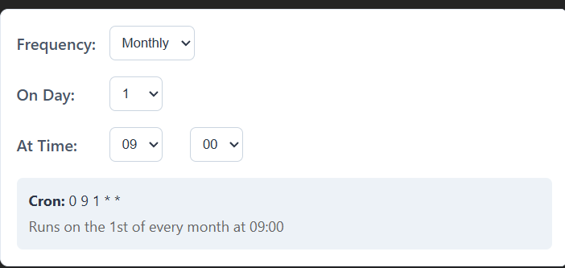

# React Easy Cron Builder

>A lightweight, zero-dependency visual cron builder component for React (TypeScript + Vite).



## Overview

React Easy Cron Builder is a small, focused UI component that helps end users compose simple cron schedules without writing cron syntax manually. It supports common scheduling patterns: daily, weekly, and monthly. The component is written in TypeScript, ships declaration files for consumers, and exports a styles file so it can be dropped into any React 18+ application with minimal setup.

## Key Features

- Simple, opinionated UI for building cron expressions (daily / weekly / monthly).
- Generates both a cron expression and a human-readable description.
- TypeScript types included (`dist/index.d.ts`) for type-safe consumption.
- Small bundle: React is externalized (peer dependency) so your app size stays small.
- Exports CSS (`./style.css`) so consumers can import default styles.

## Why use this

- Quick integration: one component, minimal styling, and clear defaults.
- Great for forms and dashboards where non-technical users must pick schedules.
- Avoids shipping a large, full-featured cron editor when you only need common schedule patterns.

## How it's different

- Focused scope: unlike large cron editors, this component intentionally supports only the most-used patterns to keep the API and UI simple.
- Type-first: ships `.d.ts` files so TypeScript projects get autocompletion and safe integration out of the box.
- Zero runtime dependencies (except React) — no date/time libs bundled by default.

## Limitations / Known Cons

- Not a full cron language editor: it does not support advanced cron features (seconds, year, complex intervals).
- Component is not yet controlled — it manages its own state (planned improvement: expose `value`/`onChange`).
- Accessibility improvements and ARIA labels may be needed for some screen-reader workflows.
- No automated tests yet — recommend adding unit tests for cron generation logic.

## Installation

Install from npm:

```bash
npm install @blue9kamrul/react-cron-scheduler
```

Or with yarn:

```bash
yarn add @blue9kamrul/react-cron-scheduler
```

## Basic Usage

```tsx
import React from 'react'
import { CronBuilder } from '@blue9kamrul/react-cron-scheduler'
import '@blue9kamrul/react-cron-scheduler/style.css'

export default function App(){
  return (
    <div style={{ padding: 20 }}>
      <CronBuilder />
    </div>
  )
}
```

The component renders a small UI to choose frequency, days (for weekly), day-of-month (for monthly), and time. It displays the resulting cron expression and a plain-language summary.

## API

Currently the package exports:

- `CronBuilder` — default component (uncontrolled). No props in v1.0.0.

Internals (for contributors):

- `src/lib/cron-logic.ts` — functions `generateCronString(state)` and `generateHumanDescription(state)`.

Planned API improvements

- Controlled usage: props `value` (cron string) and `onChange(cronString, state)` so host apps can manage state.
- Customization: `className`, `style`, and localization for human-readable descriptions.

## Development

Run locally:

```bash
npm install
npm run dev
```

Build for distribution:

```bash
npm run build
```

The `prepare` script runs the build automatically before `npm publish` so published packages include built artifacts.

## Testing the package locally

After running `npm run build`, create a tarball and test in a temporary project:

```bash
npm pack
# in a test project:
npm install ../react-cron-scheduler-1.0.0.tgz
```

This helps ensure consumers can import the component and `style.css` without issues.

## Accessibility & Quality

Recommendations before publishing widely:

- Add unit tests for `cron-logic.ts` (edge cases for weekly / monthly schedules).
- Add ARIA attributes and keyboard navigation checks for buttons and selects.
- Run accessibility (axe) scans and add visual regression tests for the UI.

## Contributing

Contributions are welcome.

1. Fork the repo and create a feature branch.
2. Run `npm install` and `npm run dev`.
3. Add tests for logic changes and ensure lint passes (`npm run lint`).
4. Open a PR with a clear description and screenshots.

## Publishing notes

- The package is scoped; `publishConfig.access` is set to `public` in `package.json` so it can be published publicly.
- Bump `version` prior to publishing.
- The `files` field includes `dist` so published packages include built assets and types.

## License

This project is licensed under the MIT License — see `LICENSE`.

